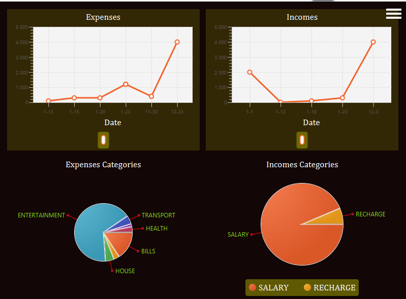

# BudgetTracker
Manage your finances with BudgetTracker and always be on track with your financial goals. App provides user with possibility to track and analyse their spendings.

## Table of contents
1. [Prerequisites](#prerequisites)
2. [How to run](#run)
3. [App description](#description)
4. [Class diagram](#diagram)
5. [Development plan](#plan)

## Prerequisites

1. Java 17  
2. Maven  

## How to run

There are two option to start this application:
1. With precompiled image
2. With Maven

### Precompiled image (Windows)
Download the version, unzip it and run .bat file in the bin folder. You don't need to have Java or Maven on your computer.

### Maven
For this method you must have Java 17 and Maven installed on your computer.
1. Open terminal in project directory
2. Run `mvn clean install` (Linux/MacOS) or `mvn clean install` (Windows)
3. Run `mvn -f desktop/pom.xml javafx:run` (Linux/MacOS) or `mvn -f desktop/pom.xml javafx:run` (Windows)

## App description

Budget Tracker is made with JavaFX and Kotlin, is set on MVC architecture.  
Application was created as a project for Object Programming course at Poznan University of Technology.  
Below there is a UML diagram that represents the structure of my app.  

App provides some features. Here are some of them:   
### Setup

  
  

### Home screen and analysis

  
  

### Incomes and expenses lists

  
  

### Financial analysis

  
  

## Class diagram

  

## How app would look like if I had unlimited time...

Current app version presents kind of basic functionalities. In the future I'd like to develop it and make something bigger out of it. One of the first functionalities I'd like to have is a remote db that would store users. Integration of this app with some outside data source would not be that hard so it's the first main target to achieve.  
Another nice to have feature is mobile and dev version. Since app is written in Kotlin it's not that hard to extract the business logic and implement it in some Native Android App. With other target platforms it's a hard one with my tech stack but we'll get there someday.  
This app has got potential to manage all finances of users not only typing them down by hand and see results. One of a long distance goal is to develop payment system so users could use our app instead of their banks' apps.
Application for sure could do with better UI, hope we'll get there too :)
